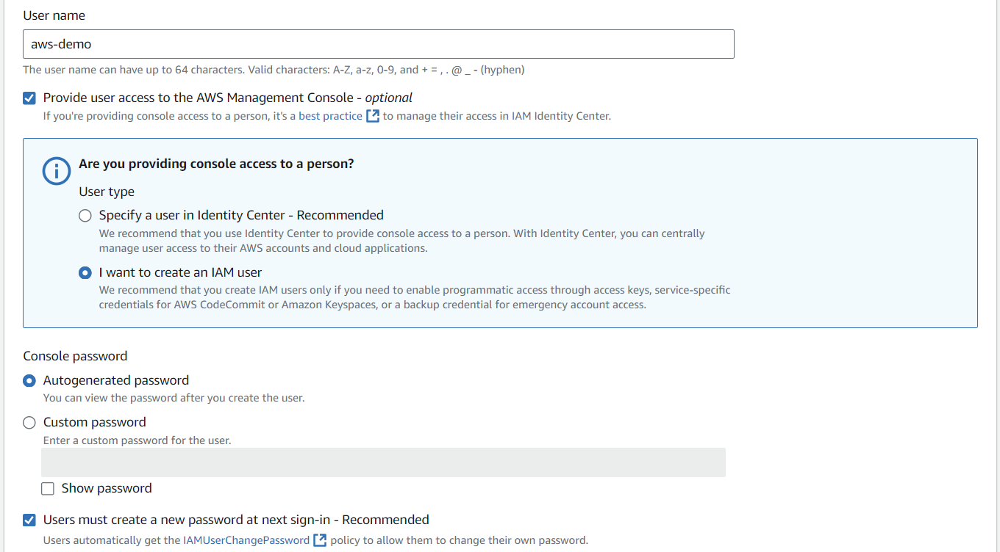
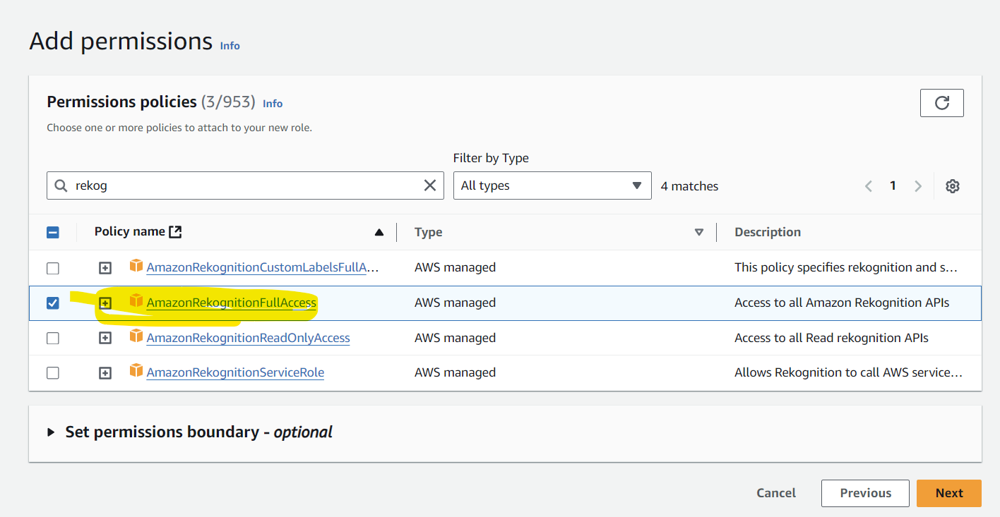
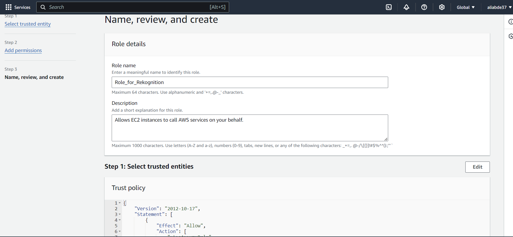

# AWS_Image_ReKognition_pipeline_JAVA

This project demonstrates an AWS Rekognition pipeline using two EC2 instances for Car Recognition and Text Recognition tasks. 
The project can be run manually on two machines or automated using Ansible across multiple EC2 instances.
Github Repository : https://github.com/mewawalaabdeali/AWS_Image_reKognition_pipeline_JAVA.git
## Project Breakdown

The project is broken down into a series of tasks to be completed in stages, as follows:

1. **Planning and Initial Setup**:
    - AWS setup --- Make sure for each service, the Region chosen is same
         - IAM role(role with full access to S3, EC2, SQS, REKOGNITION)
           - Static Method:
           - Login to AWS console and Click on Services
           - Click/Search IAM
           - Click on create User
           
             
           
           - Give a suitable name and click on the box and click on create IAM user and click next
             
             
           
           - Click on Attach Policies directly and search for Search for Rekognition, S3, SQS and attach 'AmazonRekognitionFullAccess', 'AmazonS3FullAccess', 'AmazonSQSFullAccess'
            
             
           
           - Click Next and Create User
           - Click on User created and Click on 'Security Credentials'
             
             
           - Scroll down and click on Create Access key
                      
           - Click on Command Line Interface
           
             
           
           - Click Next and Create Access key. With this key you can manually configure your ec2 instances using 'aws configure command'
           
           - Dynamic Method:
           - In the left panel, below User Groups and User, Click on Roles
            
             
           - Click on Create role
           - Click on AWS Services and Use case - choose EC2 and click Next
             
             
           
           - Attach Policies. Search for Rekognition, S3, SQS and attach 'AmazonRekognitionFullAccess', 'AmazonS3FullAccess', 'AmazonSQSFullAccess'
            
             
           - Click Next and give a Unique name and click create role
           
             
           - You can see the role created
           
         - S3 bucket where images are uploaded
           - Click on Services and click/Search on S3
           
            
      
           - Click on create Bucket, for this project we will use the project created bucket : "cs643-njit-project1"
           - This will be declared in the variables
           
            
      
           - Click on general purpose
           - Give a unique name
           - Untick on the box to make it public and you can skip all other settings
           - Click on create bucket
           
            
           
         - An SQS queue for messages polling
           - Login into AWS Console and click on Services
           - Search for Simple Queue service:
           
            
      
           - Click on Create Queue
           
            
      
           - Based on the code handling you can either choose, Standard or FIFO
           - You can leave rest of the settings and click on Create Queue
           - Once the queue is created, click on the created queue
           
            
      
           - In the Details section, you will see URL, Copy and save this url as this will be declared in the variables
           
            
      
           - This URL is used to communicate with the SQS services
           - Click on Send and Receive messages
           - You will navigate to a screen as below, scroll down and you shall see "Poll for messages tab"
            
           
           - This is where you can test the queued messages.
           
         - Launch EC2 Instances
           - Login to AWS Console
           - Search/Click on Services and click on EC2
           
            
           
           - On the top right corner, Click on Launch Instances
           
            
      
           - Give the name and Number of Instances
            
           - You can choose Ubuntu, Redhat, Amazon, they are all different flavors of linux, You can choose any. Though some of them are free tier eligible
          
            
           
           - Architecture - 64-bit (x86) and Instance type - t2-micro as it is free-tier eligible
            
            
           - If you have an existing key pair, you can choose that from the drop down else create new
           
            
           - In network settings : keep the settings default, it will choose default security group and default VPC
            
            
           - Configure storage : You can keep default and click on Launch Instances
           
            
      
           - Once Launched, Click on Instances to view the launched Instances. Instances generally take 2-3 to launch
           - Wait till the Instance state becomes Running and Status check 2/2
           - Now click on Instance, CLick on Actions on the top right corner, Under Security click on Modify IAM role
            
            
           - Under IAM role, drop down and choose the IAM role we created earlier and Click on Update IAM Role.
            
            
      
           - Now the Access Policies are attached to the machines. It can access the services from AWS.
           - This is a dynamic method where AWS configures the key automatically and the suitable policies are attached
           
         
           
   - Project Setup 
      - Eclipse or Intellij that uses Maven.
      - POM setup to ensure 2 jars are created separately
      - AWS SDK dependencies.
        AWS SDK to use objects and libraries in the code
           - https://docs.aws.amazon.com/code-library/latest/ug/what-is-code-library.html
           - https://github.com/awsdocs/aws-doc-sdk-examples/blob/main/java/example_code/rekognition/rekognition-image-java-detect-text.java
           - https://sdk.amazonaws.com/java/api/latest/
           - https://docs.aws.amazon.com/rekognition/latest/APIReference/API_DetectLabels.html
           - https://docs.aws.amazon.com/sdk-for-java/v1/developer-guide/setup-project-maven.html
        
   - 2 JAVA classes 
        - Object Rekognition - Car
        - Text Rekognition - Text
        
   - ENVIRONMENT setup
      - JAVA and MAVEN installation in EC2 instances
      - AWS key configuration on EC2 instances
      
   - Variables
      - SQS queue url
      - S3 bucket name
    
2. **Manual Execution on Two Machines**:
    - Performed initial tests manually
    - Car Rekognition on Machine 1
    - Text Rekognition on Machine  2

3. **Automation with Ansible**:
    - Configured Ansible Control-node, Worker-node setup
    - Written Ansible playbook to automate parallel execution of the Rekognition jobs.
---

## Running the Project with 2 Machines

### Prerequisites
- IAM Role for EC2 with permissions for SQS, S3, and Rekognition
- AWS EC2 instances (2 machines)
- AWS key pair for SSH access
- Pre-configured Java and Maven on the EC2 machines
- JAR files for Car ReKognition and Text ReKognition

### Steps to Run

1. **Task 1: Car ReKognition (Machine 1)**
    - SSH into Machine 1 using your key:
      ```bash
      ssh -i your-key.pem ec2-user@<machine1-public-ip>
      ```
    - Clone the repository and navigate to the project directory:
      ```bash
      git clone https://github.com/mewawalaabdeali/AWS_Image_reKognition_pipeline_JAVA.git
      cd AWS_Image_reKognition_pipeline_JAVA
      ```
    - Build the project and run the Car Recognition JAR:
      ```bash
      mvn clean package
      java -jar Car_Rekognition.jar
      ```

2. **Task 2: Text ReKognition (Machine 2)**
    - SSH into Machine 2 using your key:
      ```bash
      ssh -i your-key.pem ec2-user@<machine2-public-ip>
      ```
    - Clone the repository and navigate to the project directory:
      ```bash
      git clone https://github.com/mewawalaabdeali/AWS_Image_reKognition_pipeline_JAVA.git
      cd AWS_Image_reKognition_pipeline_JAVA
      ```
    - Build the project and run the Text Recognition JAR:
      ```bash
      mvn clean package
      java -jar Text_Rekognition.jar
      ```

---

## Running the Project with Ansible

### Prerequisites
- 3 EC2 machines (1 control node and 2 worker nodes)
- Java and Maven set up on all three machines
- Ansible set up on all three machines
  - https://stackoverflow.com/questions/30812453/how-to-install-ansible-on-amazon-aws
  - Ansible configuration also involves setting up ssh into both the machines from master
  ```bash
      ssh -keygen
   ```
  - Copy the public key from control node to authorized key directory of the worker nodes.
  - AWS key configuration on all three machines
  - Use Command "aws configure" and provide access key and passcode to setup AWS key
  - Private IP addresses of the worker nodes

### Steps to Run

1. **Task 1: Add Private IPs of the worker nodes in Inventory.ini file in the repository**
   
2. **Task 2: Build the Project**
    - SSH into the control node and clone the repository:
      ```bash
      ssh -i your-key.pem ec2-user@<control-node-public-ip>
      git clone https://github.com/mewawalaabdeali/AWS_Image_reKognition_pipeline_JAVA.git
      cd AWS_Image_reKognition_pipeline_JAVA
      ```
    - Build the project:
      ```bash
      mvn clean package
       ```
      
      

   


3. **Task 3: Configure and Run Ansible**
    - Configure Inventory file, check ssh connection with worker nodes, check aws config
    - Run the Ansible playbook:
      ```bash
      ansible-playbook -i inventory.ini ansible.yaml
      ```
      
     


4. **Task 4: Wait for Completion**
    - Wait for the execution to complete. This may take some time.
    - Once complete, check the output file in the same directory for the results.

---

**JAVA MAVEN Installation on EC2 Machines**
   - Login into ec2 machines via ssh
     


   - Install packages – JAVA and MAVEN
   - JAVA
   - 
     
   
     


   - Maven 
     
     


## Additional Notes

- Ensure that all IAM roles are properly configured with necessary permissions for SQS, S3, and Rekognition services.
- Be sure to monitor the logs for both machines to verify that the services are running as expected.

    
