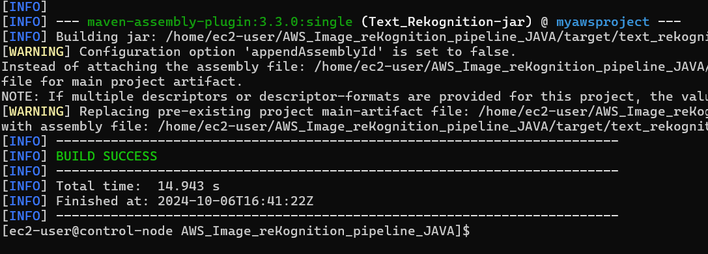
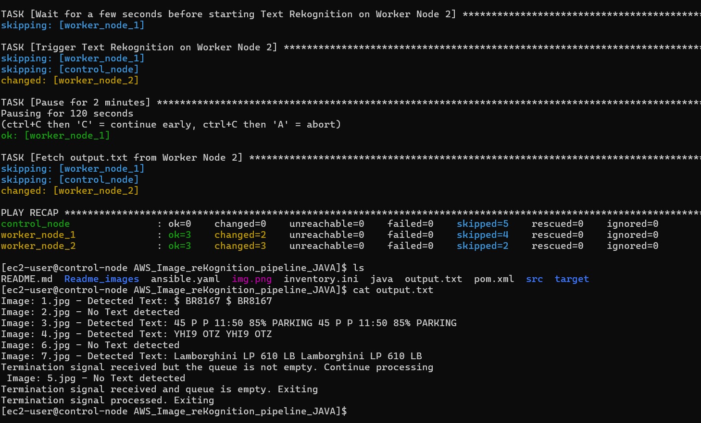

# AWS_Image_reKognition_pipeline_JAVA

This project demonstrates an AWS Rekognition pipeline using two EC2 instances for Car Recognition and Text Recognition tasks. 
The project can be run manually on two machines or automated using Ansible across multiple EC2 instances.

## Project Breakdown

The project is broken down into a series of tasks to be completed in stages, as follows:

1. **Planning and Initial Setup**:
    - AWS setup 
         - IAM role(role with full access to S3, EC2, SQS, REKOGNITION)
         - S3 bucket where images are uploaded
         - An SQS queue for messages polling
         - AWS SDK to use objects and libraries in the code.
           - https://docs.aws.amazon.com/code-library/latest/ug/what-is-code-library.html
           - https://github.com/awsdocs/aws-doc-sdk-examples/blob/main/java/example_code/rekognition/rekognition-image-java-detect-text.java
           - https://sdk.amazonaws.com/java/api/latest/
           - https://docs.aws.amazon.com/rekognition/latest/APIReference/API_DetectLabels.html
           - https://docs.aws.amazon.com/sdk-for-java/v1/developer-guide/setup-project-maven.html
    - Project Setup 
      - Eclipse or Intellij that uses Maven.
      - POM setup to ensure 2 jars are created separately
      - AWS SDK dependencies.
      - 2 JAVA classes 
        - Object Rekognition - Car
        - Text Rekognition - Text
    - ENVIRONMENT setup
      - JAVA and MAVEN installation in EC2 instances
      - AWS key configuration on EC2 instances
    
2. **Manual Execution on Two Machines**:
    - Performed initial tests manually
    - Car Rekognition on Machine 1
    - Text Rekognition on Machine  2

3. **Automation with Ansible**:
    - Configured Ansible Control-node, Worker-node setup
    - Written Ansible playbook to automate parallel execution of the Rekognition jobs.
---

## Running the Project with 2 Machines

### Prerequisites
- IAM Role for EC2 with permissions for SQS, S3, and Rekognition
- AWS EC2 instances (2 machines)
- AWS key pair for SSH access
- Pre-configured Java and Maven on the EC2 machines
- JAR files for Car ReKognition and Text ReKognition

### Steps to Run

1. **Task 1: Car ReKognition (Machine 1)**
    - SSH into Machine 1 using your key:
      ```bash
      ssh -i your-key.pem ec2-user@<machine1-public-ip>
      ```
    - Clone the repository and navigate to the project directory:
      ```bash
      git clone <repository-url>
      cd AWS-directory
      ```
    - Build the project and run the Car Recognition JAR:
      ```bash
      mvn clean package
      java -jar Car-Rekognition.jar
      ```

2. **Task 2: Text ReKognition (Machine 2)**
    - SSH into Machine 2 using your key:
      ```bash
      ssh -i your-key.pem ec2-user@<machine2-public-ip>
      ```
    - Clone the repository and navigate to the project directory:
      ```bash
      git clone <repository-url>
      cd AWS-directory
      ```
    - Build the project and run the Text Recognition JAR:
      ```bash
      mvn clean package
      java -jar Text-Rekognition.jar
      ```

---

## Running the Project with Ansible

### Prerequisites
- 3 EC2 machines (1 control node and 2 worker nodes)
- Java and Maven set up on all three machines
- Ansible set up on all three machines
  - https://stackoverflow.com/questions/30812453/how-to-install-ansible-on-amazon-aws
- AWS key configuration on all three machines
  - Use Command "aws configure" and provide access key and passcode to setup AWS key
- Private IP addresses of the worker nodes

### Steps to Run

1. **Task 1: Add Private IPs of the worker nodes in Inventory.ini file in the repository**
2. **Task 2: Build the Project**
    - SSH into the control node and clone the repository:
      ```bash
      ssh -i your-key.pem ec2-user@<control-node-public-ip>
      git clone <repository-url>
      cd AWS-directory
      ```
    - Build the project:
      ```bash
      mvn clean package
      ```
   

2. **Task 3: Configure and Run Ansible**
    - Enter the private IPs of the worker nodes into the `inventory.ini` file under the `[worker_nodes]` section.

    - Run the Ansible playbook:
      ```bash
      ansible-playbook -i inventory.ini ansible.yaml
      ```
      
   

3. **Task 4: Wait for Completion**
    - Wait for the execution to complete. This may take some time.
    - Once complete, check the output file in the same directory for the results.

---

4. **Task 5: JAVA MAVEN Installation on EC2 Machines**
   - Login into ec2 machines via ssh
   
   - Install packages – JAVA and MAVEN
   - JAVA
   
   
   - Maven 
   
   
## Additional Notes

- Ensure that all IAM roles are properly configured with necessary permissions for SQS, S3, and Rekognition services.
- Be sure to monitor the logs for both machines to verify that the services are running as expected.

   
